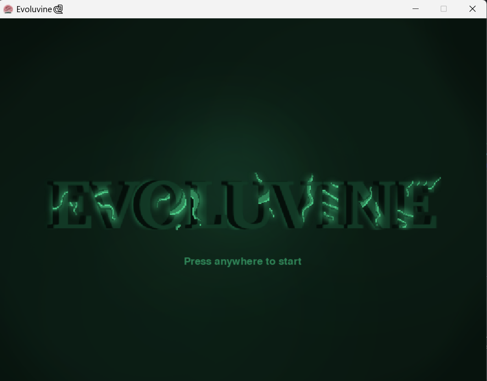
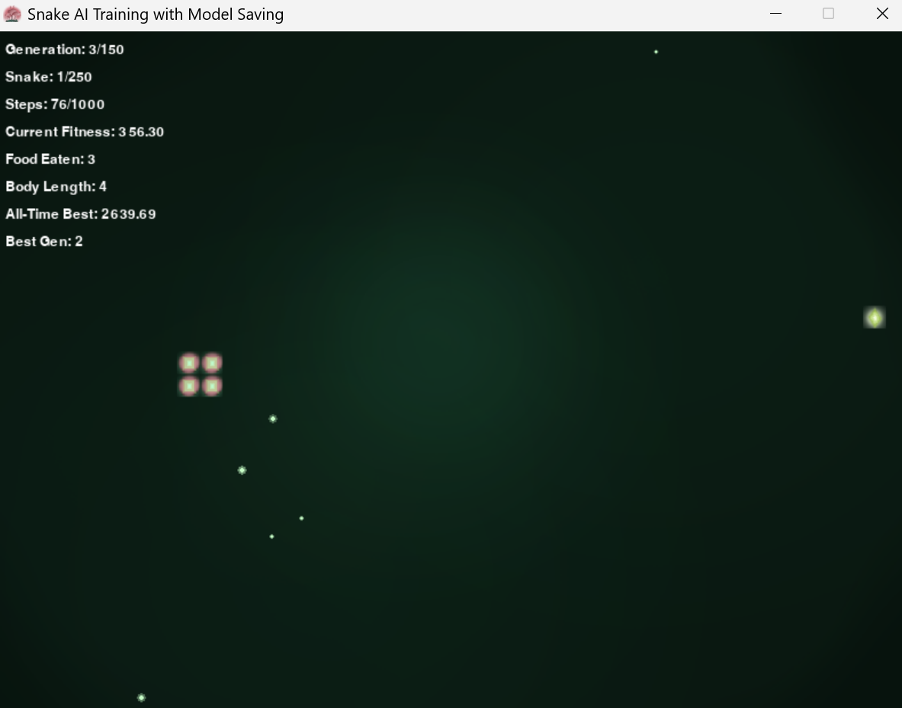

<p align="center">
  
</p>


# Evoluvine
*An AI-Enhanced Snake Game Using Genetic Algorithms and Neural Networks*

---

## Table of Contents

1. [Introduction](#1-introduction)  
2. [Project Overview](#2-project-overview)  
3. [Technical Implementation](#3-technical-implementation)  
   - 3.1 [Neural Network Architecture](#31-neural-network-architecture)  
   - 3.2 [Genetic Algorithm Components](#32-genetic-algorithm-components)  
   - 3.3 [Fitness Function Design](#33-fitness-function-design)  
4. [Results and Performance](#4-results-and-performance)  
5. [Installation and Usage](#5-installation-and-usage)  
6. [References](#6-references)

---

## 1. Introduction

**Evoluvine** is a classic Snake game enhanced with artificial intelligence using genetic algorithm techniques. This project demonstrates the application of evolutionary computation and neural networks to create an AI that learns to play Snake through natural selection principles.

### 1.1 What Can You Do With Evoluvine?

- Play the classic Snake game yourself  
- Train AI snakes using genetic algorithms  
- Watch the training process in real-time  
- Observe AI gameplay with pre-trained models

### 1.2 Inspiration

This implementation draws inspiration from evolutionary algorithms and is based on research in artificial intelligence applications in gaming, particularly the work by Piotr Bialas from Silesian University of Technology on _"Implementation of artificial intelligence in Snake Game using genetic algorithm and neural networks."_

---

## 2. Project Overview

Evoluvine combines classical game development with modern AI techniques to create an intelligent agent capable of playing Snake. The project uses:

- **Genetic Algorithms** for evolving optimal strategies  
- **Neural Networks** as the "brain" of each snake  
- **Fitness-based selection** for improving performance across generations  
- **Real-time visualization** of both training and gameplay

<p align="center">
  
  
</p>

---

## 3. Technical Implementation

### 3.1 Neural Network Architecture

The AI brain uses a simple yet effective feedforward neural network with the following structure:

**Network Layout:** Input Layer (4 neurons) → Hidden Layer (6 neurons) → Output Layer (3 neurons)

#### 3.1.1 Input Features (4 dimensions):

- **Forward Danger**: Binary (1/0) - Obstacle directly ahead  
- **Left Danger**: Binary (1/0) - Obstacle to the left  
- **Right Danger**: Binary (1/0) - Obstacle to the right  
- **Food Angle**: Float (-1 to 1) - Sine of angle between current direction and food

#### 3.1.2 Output Actions (3 dimensions):

- **Forward**: Continue in current direction  
- **Left**: Turn left relative to current direction  
- **Right**: Turn right relative to current direction

#### 3.1.3 Activation Function:

The network uses the **Sigmoid** activation function, calculated as `1 / (1 + e^-x)` with clipping applied to prevent numerical overflow.

#### 3.1.4 Weight Initialization:

**Xavier/Glorot Initialization** is employed.

---

### 3.2 Genetic Algorithm Components

#### 3.2.1 Population Parameters:

- **Population Size**: 250 snakes per generation  
- **Maximum Generations**: 150  
- **Elitism Rate**: 10%  
- **Maximum Steps per Snake**: 1000  

#### 3.2.2 Selection Strategy:

**Two-Point Roulette Wheel Selection** using adjusted fitness values.

#### 3.2.3 Crossover Method:

**Arithmetic Crossover** with α = 0.5, child weights and biases are averaged from parents.

#### 3.2.4 Mutation Strategy:

**Whole Mutation** at 30% , randomly replaces selected weights/biases.

#### 3.2.5 Diversity Maintenance:

**Fitness Sharing** based on genetic distance and niche count.

---

### 3.3 Fitness Function Design

Designed to encourage survival, efficiency, exploration, and discourage loops or stagnation.

#### Core Components:

**Food Collection**  
- +100 per food  
- +20 per body segment  
- Idle counter reset on collection

**Survival**  
- +0.1 per step  
- Movement toward food: +8× improvement  
- Movement away: -1.5× increase  

**Exploration**  
- +5 per new zone  
- +1 per varied movement

**Penalties**  
- Loop: -15  
- Back-and-forth: -10  
- Confinement: -5  
- Timeout/Idle: -30  
- Death: -25

---

## 4. Results and Performance

### 4.1 Training Configuration

- 250 snakes  
- 150 generations  
- 1000 steps per snake  
- CPU-based training

### 4.2 Best Results

- **Best Fitness**: 11,676.04  
- **Food Collected**: 39  
- **Body Length**: 40  
- **Survival**: Full duration (1000 steps)

---

## 5. Installation and Usage

### 5.1 Prerequisites
The system requires Python 3.7 or higher, along with the pygame and numpy libraries for graphics rendering and numerical computations respectively.

### 5.2 Installation Steps

**Step 1: Clone the Repository**

```bash
git clone https://github.com/yourusername/evoluvine.git
cd evoluvine
```

**Step 2: Install Dependencies**

```
pip install -r requirements.txt

```

### 5.3 Usage Options

#### 5.3.1 Play the Game Yourself

```
python src/main.py

```

#### 5.3.2 Train AI Snakes
```
python src/train.py

```
#### 5.3.3 Watch Trained AI Play
```
python src/evoluvine.py

```

### 5.4 Controls (Human Play)
- **Arrow Keys**: Direction control for manual gameplay

---

## 6. References

1. **Bialas, P.** "Implementation of artificial intelligence in Snake Game using genetic algorithm and neural networks." *Silesian University of Technology*, CEUR-WS.org/Vol-2468/p9.pdf
